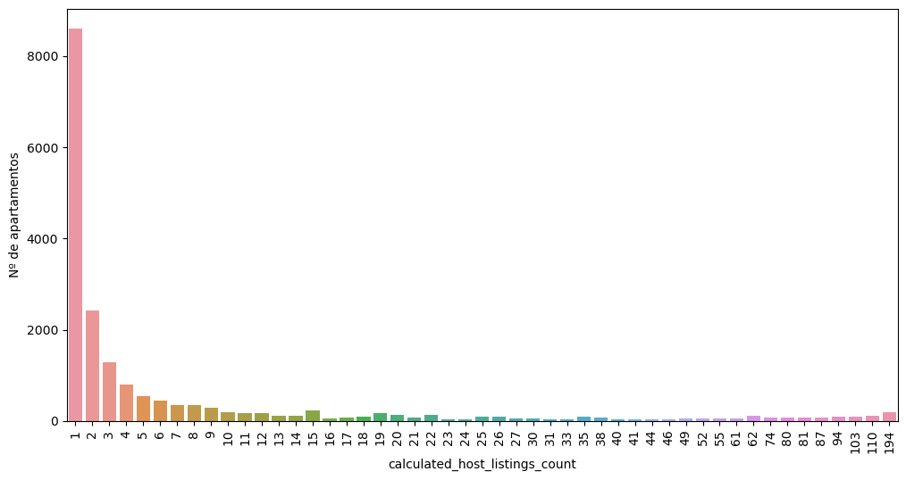

# Preguntas semilla 
El presente documento recoge las principales características del mercado de pisos de alquiler turístico en Madrid capital.     
Puede tomarse como un análisis de mercado explicativo de las principales variables que definen dicho mercado y como memoria resumen de todo lo analizado.

## 0. Dataset

### El dataset utilizado se consiguió a través de internet en l página [Inside AirBnb](https://insideairbnb.com/get-the-data).

- El dataset consta de 6 archivos:
    - listings.csv
    - listings.cvs.gz
    - neighbourhoods.csv
    - neighbourhoods.geojson
    - reviews.csv
    - reviews.csv.gz

Se complementó con el conseguido de la página web [Idealista](https://www.idealista.com/sala-de-prensa/informes-precio-vivienda/venta/madrid-comunidad/madrid-provincia/madrid/), guardado con el nombre:
    - idealista.xlsx

### En la carpeta del EDA se encuentran:
- Tres carpetas:
    - *data*, que recoge los dataset y los archivos creados durante la exploración.
    - *img_eda*, que contiene las imágenes utilizadas para la presentación.
    - *mapas*, en donde se han guardado los mapas realizados para la visualización de los datos.
- Los archivos de información:  
    - *00_Readme.mkd*, es documento en formato markdown en el que se ha realizado un resumen breve sobre el proyecto realizado en donde se explica los objetivos así como las conclusiones principales.
    - *01_Memoria.mkd*, es un documento en formato markdown en donde se ha realizado una recopilación de la información que se ha ido obteniendo a lo largo del análisis.  
- Los archivos de análisis (extensión .ipynb):  
    - `01.Exploración_datos`: en este archivo se raliza la primera toma de contacto con los datos y se revisan las variables de cada uno. La información relevante para cada dataset se ha volcado en un archivo que se encuentra dentro de la carpeta 'data' denominado 'analisis_variables_prov.xlsx' y de forma definitiva el archivo denominado 'analisis_variables.xlsx'.
    - `02.Limpieza_manipulacion_datos`: su propio nombre dice el contenido del archivo. Ya se carga el archivo definitivo sobre el que trabajar
    - `03.Nuevas_variables_discretizacion`: en este archivo se ha realizado la inclusión en el dataset de las nuevas variables así como de la discretización de otras para facilitar el análisis posterior.
    - `04.Analisis_univariable`: Se realiza el análisis de cada variable una a una.
    - `05.Analisis_bivariante`: en este archivo se realizó cuatro tipos de análisis:
        - sobre el dataset general
        - sobre el dataset filtrando por el valor 'Entire home/apt' de la variable 'room_type.
        - sobre el dataset filtrando por el valor 'Private room' de la variable 'room_type.
        - sobre el dataset filtrando por el valor 'shared room' de la variable 'room_type.
    - `06.Respuesta_preguntas_semilla`: en este arvhivo se trató de sintetizar toda la información relevante que se fue obteniendo. Fruto de este archivo, se ha realizado este documento.
    - `07.Localización`: se explora de forma visual a través de la biblioteca 'folium' las localizaciones de distritos, puntos de interés, ubicación de inmuebles objetivo...
    - `08.Distancias`: se exploró si las distancias a diferentes puntos de interés y culturales pudieran ser un factor determinante a la hora de establecer un precio de alquiler.
    - `data_idealista_webscraping`: fue un intento de sacar información de la web de Idealista, pero me daba constantemente un error 500. Me volví a poner en contacto con ellos pero no me han contestado.
    
- Un archivo de python: `EDA_function_tools`: se recogen las funciones principales de Jaime para realizar gráficos.

- El archivo de power-point con la presentación: `presentación_mercado_turístico`.

### Organización de cada archivo .ipynb

Se ha tratado de organizar la información bajo una misma estructura para faclitar el acceso posterior a la misma.  
Estructura de cada archivo:
- Importación de librerías y datos
- Funciones
- El desarrollo de cada archivo, haciendo unos de los 'headers' de markdown, por lo que se puede dar a `esquema` para visualizar de forma rápida cada análisis y todos los que se han realizado en ese mismo documento.


## 1. Contextualización
 ### **1.1. Número de distritos que hay en Madrid Capital**
- Son 21 distritos
```
 'Arganzuela',
 'Barajas',
 'Carabanchel',
 'Centro',
 'Chamartín',
 'Chamberí',
 'Ciudad Lineal',
 'Fuencarral - El Pardo',
 'Hortaleza',
 'Latina',
 'Moncloa - Aravaca',
 'Moratalaz',
 'Puente de Vallecas',
 'Retiro',
 'Salamanca',
 'San Blas - Canillejas',
 'Tetuán',
 'Usera',
 'Vicálvaro',
 'Villa de Vallecas',
 'Villaverde'
```

### **1.2. Precio medio por m2 en los distritos actualizado a enero de 2024**
```
count    18906.00
mean      5260.90
std       1459.08
min       1988.00
25%       4344.00
50%       6144.00
75%       6144.00
max       7374.00
```


 ### **1.3. Los 5 distritos con mayor precio medio por m2**
 ```
Salamanca    7374.0
Chamberí     6347.0
Centro       6144.0
Chamartín    6039.0
Retiro       5447.0
 ```
 ### **1.4. Los 5 distritos con menor precio por m2**
 ```
Villaverde            1988.0
Puente de Vallecas    2344.0
Usera                 2368.0
Carabanchel           2612.0
Latina                2699.0
 ```
 ### **1.5. Número de barrios en total**
 - Son 128
 
 ### **1.6. Número de barrios que hay en cada distrito**
 ```
 distrito
Ciudad Lineal            9
San Blas - Canillejas    8
Fuencarral - El Pardo    8
Arganzuela               7
Usera                    7
Latina                   7
Moncloa - Aravaca        7
Carabanchel              7
Chamberí                 6
Hortaleza                6
Chamartín                6
Moratalaz                6
Puente de Vallecas       6
Retiro                   6
Salamanca                6
Centro                   6
Tetuán                   6
Barajas                  5
Villaverde               5
Vicálvaro                2
Villa de Vallecas        2
 ```
 ### **1.7. Los 5 barrios con mayor precio medio por m2**
 ```
 neighbourhood_cleansed
Castellana          7374.0
Fuente del Berro    7374.0
Goya                7374.0
Guindalera          7374.0
Lista               7374.0
 ```
 ### **1.8. Los 5 barrios con menor precio por m2**
 ```
 neighbourhood_cleansed
Butarque         1988.0
Los Angeles      1988.0
Los Rosales      1988.0
San Andrés       1988.0
San Cristobal    1988.0
```


## 2. Oferta
 ### **2.1. Oferta total de alquiler**
 - 18906 inmuebles (según esta base de datos)

 ### **2.2. Tipo de alquiler**
 - Son 4
 ```
 'Private room',
 'Entire home/apt',
 'Shared room',
 'Hotel room'
 ```
 ### **2.3. Oferta por tipo de alquiler**
 ```
 room_type
Entire home/apt    58.700942
Private room       39.088120
Shared room         1.364646
Hotel room          0.846292
 ```

## 3. Distribución de la oferta
 ### **3.1. Los 5 distritos con mayor oferta de alquiler**
 ```
 distrito (en valor absoluto)
Centro                   8432
Salamanca                1266
Chamberí                 1148
Arganzuela               1070
Tetuán                    811

 distrito (en %)
Centro                   44.60
Salamanca                 6.70
Chamberí                  6.07
Arganzuela                5.66
Tetuán                    4.29
 ```
 ### **3.2. Los 5 distritos con menor oferta de alquiler**
 ```
 distrito (en valor absoluto)
Villaverde                186
Barajas                   147
Moratalaz                 131
Villa de Vallecas         105
Vicálvaro                  71

 distrito (en %)
Villaverde                0.98
Barajas                   0.78
Moratalaz                 0.69
Villa de Vallecas         0.56
Vicálvaro                 0.38

 ```
### **3.3. Los 5 barrios con mayor oferta de alquiler (y por distrito)**
 ```
distrito              neighbourhood_cleansed (valor absoluto)
Centro                Embajadores               2255
                       Universidad               1772
                       Palacio                   1533
                       Sol                       1125
                       Justicia                   910

distrito              neighbourhood_cleansed   (en %)
Centro                Embajadores               12.0
                       Universidad                9.0
                       Palacio                    8.0
                       Sol                        6.0
                       Justicia                   5.0

 ```

### **3.4. Los 5 barrios con menor oferta de alquiler**
 ```
 distrito               neighbourhood_cleansed (valor absoluto)
Fuencarral - El Pardo  Fuentelareina                5
Moncloa - Aravaca      Valdemarín                   4
Fuencarral - El Pardo  El Pardo                     3
Moratalaz              Horcajo                      2
Ciudad Lineal          Atalaya                      1

distrito               neighbourhood_cleansed   (en %)
Fuencarral - El Pardo  Fuentelareina              0.0
Moncloa - Aravaca      Valdemarín                 0.0
Fuencarral - El Pardo  El Pardo                   0.0
Moratalaz              Horcajo                    0.0
Ciudad Lineal          Atalaya                    0.0


 ```

## 4. Propietarios (en manos de quien está)
 ### **4.1. Distribución de las propiedades en propietarios**

 

- El 75% aprox tienen 7 o menos de 7 propiedades anunciadas
```
calculated_host_listings_count (# frecuencia relativa)
1      45.51
2      12.86
3       6.82
4       4.27
5       2.94
6       2.38
7       1.85


calculated_host_listings_count (# La frecuencia acumulada)
1       45.51 
2       58.37 
3       65.20
4       69.47
5       72.41
6       74.79
7       76.64
```
- Si bien existen una serie de grupos que poseen o gestionan, en número absoluto, un elevado número de apartamentos. Se ha identificado a algunos de ellos:
    - MitHouse (https://www.mithouse.es/)
    - Ivory Homes (https://www.ivoryhomes.es/)
    - Welcomer group (https://www.welcomergroup.com/es/)
    - Alter Home (https://alterhome.com/en)
    - Luxury Rental Madrid (https://luxuryrentalsmadrid.com/)

- En algunos casos utilizan sus nombre comerciales, pero otros se hacen pasar por particulares:
```
host_name
Marco                      194
Daniel                     142
Luxury Rentals Madrid      110
Welcomergroup              103
Ivory                       94
Svetlana                    87
```


 ### **4.2. Tipos de alquiler que ofrecen**  
 (Esta variable se discretizará más adelante)
Del total general:
```
room_type   (valor absoluto)
Entire home/apt    11098
Private room        7390
Shared room          258
Hotel room           160

room_type  (valor relativo)
Entire home/apt    58.70
Private room       39.09
Shared room         1.36
Hotel room          0.85

```

 - 1 propiedad 
```
 room_type
Entire home/apt    4638 (53.9%) #Porcentajes en relación a esta segmentación
Private room       3868 (44.95%)
Shared room          85 (0.98%)
Hotel room           13 (0.15%)
```
- Entre 2 y 5 propiedades:
```
room_type
Entire home/apt    2632 (51.7%) #Porcentajes en relación a esta segmentación
Private room       2356 (46.33%)
Shared room          61 (1.19%)
Hotel room           36 (0.70%)

```
- Entre 6 y 14 propiedades:
```
room_type
Entire home/apt    1492 (67.2%) #Porcentajes en relación a esta segmentación
Private room        585 (26.36%)
Shared room          84 (3.78%)
Hotel room           58 (2.6%)
```

- Más de 15 propiedades:
```
room_type
Entire home/apt    2336 (77.9%) #Porcentajes en relación a esta segmentación
Private room        581 (19.37%)
Hotel room           53 (1.7%)
Shared room          28 (0.93%)
```
Parece ser que el mercado del alquiler de apartamentos está copado por pequeños, medianos y grandes inversores


 ### **4.3. Distribución por propiedades en los Distritos**
- #### **4.3.1 Entire home/apt**  
Los 5 distritos con mayor número de apartamentos en alquiler son:
```
distrito (valor absoluto)
Centro        5994
Salamanca      880
Chamberí       644
Arganzuela     577
Tetuán         478

distrito (valor relativo)
Centro        31.70
Salamanca      4.65
Chamberí       3.41
Arganzuela     3.05
Tetuán         2.53
```

Los 5 distritos con menor número de apartamentos en alquiler son:
```
distrito     (valor absoluto)
Barajas              42
Villaverde           42
Villa de Vallecas    28
Moratalaz            26
Vicálvaro            13

distrito    (valor relativo) 
Barajas              0.22
Villaverde           0.22
Villa de Vallecas    0.15
Moratalaz            0.14
Vicálvaro            0.07
```
- #### **4.3.2 Private room**  
Los 5 distritos con mayor número de oferta de habitaciones privadas son:
```
distrito  (valor absoluto)
Centro           2181
Arganzuela        481
Chamberí          475
Carabanchel       413
Ciudad Lineal     380

distrito  (valor relativo)
Centro           12.0
Arganzuela        3.0
Chamberí          3.0
Carabanchel       2.0
Ciudad Lineal     2.0

```
Los 5 distritos con menor oferta de habitaciones privadas en alquiler son:
```
distrito  (valor absoluto)
Villaverde           131
Barajas              103
Moratalaz            103
Villa de Vallecas     74
Vicálvaro             57

distrito  (valor relativo)
Villaverde           1.0
Barajas              1.0
Moratalaz            1.0
Villa de Vallecas    0.0
Vicálvaro            0.0
```
- #### **4.3.3 Shared room**  
Los 5 distritos con mayor oferta de habitaciones compartidas son:
```
distrito   (valor absoluto)
Centro           131
Chamberí          22
Villaverde        12
Ciudad Lineal     11
Latina            11

distrito   (valor relativo)
Centro           1.0
Chamberí         0.0
Villaverde       0.0
Ciudad Lineal    0.0
Latina           0.0
```
Los 5 distritos con menor oferta de habitaciones compartidas son:
```
distrito       (valor absoluto)
Barajas                  2
Fuencarral - El Pardo    1
Hortaleza                1
Moratalaz                1
Vicálvaro                1

distrito         (valor relativo)
Barajas                  0.0
Fuencarral - El Pardo    0.0
Hortaleza                0.0
Moratalaz                0.0
Vicálvaro                0.0
```
- #### **4.3.4 Hotel room**  
Los 5 distritos con mayor oferta de habitaciones de hotel son:
```
distrito  (valor absoluto)
Centro       126
Salamanca     11
Chamberí       7
Hortaleza      5
Chamartín      4

distrito  (valor relativo)
Centro       1.0
Salamanca    0.0
Chamberí     0.0
Hortaleza    0.0
Chamartín    0.0
```

Los 5 distritos con menor oferta de habitaciones de hotel son:
```
distrito       (valor absoluto)
Ciudad Lineal         1
Moncloa - Aravaca     1
Moratalaz             1
Puente de Vallecas    1
Villaverde            1

distrito       (valor relativo)
Ciudad Lineal         0.0
Moncloa - Aravaca     0.0
Moratalaz             0.0
Puente de Vallecas    0.0
Villaverde            0.0
```
## 5. Tipo de vivienda
 
 ### **5.1. Media de Nº de habitaciones por tipo de oferta**
 

| room_type      | count   | mean  | std   | min   | 25%   | 50%   | 75%   | max   |
| -------------- | ------- | ----- | ----- | ----- | ----- | ----- | ----- | ----- |
| Entire home/apt| 11098.0 | 1.63  | 0.88  | 1.0   | 1.0   | 1.0   | 2.0   | 10.0  |
| Hotel room     | 160.0   | 1.14  | 0.53  | 1.0   | 1.0   | 1.0   | 1.0   | 4.0   |
| Private room   | 7390.0  | 1.12  | 0.60  | 1.0   | 1.0   | 1.0   | 1.0   | 18.0  |
| Shared room    | 258.0   | 1.00  | 0.00  | 1.0   | 1.0   | 1.0   | 1.0   | 1.0   |


 ### **5.2. Nº de baños medio por tipo de oferta**

|     room_type  | count   | mean  | std   | min   | 25%   | 50%   | 75%   | max   |
|----------------|---------|-------|-------|-------|-------|-------|-------|-------|
| Entire home/apt| 11098.0 | 1.31  | 0.60  | 0.0   | 1.0   | 1.0   | 1.50  | 10.0  |
| Hotel room     | 160.0   | 1.09  | 0.32  | 1.0   | 1.0   | 1.0   | 1.00  | 3.0   |
| Private room   | 7390.0  | 1.22  | 0.64  | 0.0   | 1.0   | 1.0   | 1.00  | 14.0  |
| Shared room    | 258.0   | 1.61  | 1.17  | 0.0   | 1.0   | 1.0   | 1.88  | 8.0   |


 ### **5.3. Nº de camas medio por tipo de oferta**
 
 |   room_type   | count   | mean  | std   | min   | 25%   | 50%   | 75%   | max   |
|----------------|---------|-------|-------|-------|-------|-------|-------|-------|
| Entire home/apt| 11098.0 | 2.36  | 1.53  | 0.0   | 1.0   | 2.0   | 3.0   | 18.0  |
| Hotel room     | 160.0   | 1.51  | 1.09  | 0.0   | 1.0   | 1.0   | 2.0   | 8.0   |
| Private room   | 7390.0  | 1.21  | 0.84  | 0.0   | 1.0   | 1.0   | 1.0   | 24.0  |
| Shared room    | 258.0   | 3.00  | 2.79  | 0.0   | 1.0   | 2.0   | 4.0   | 12.0  |

 ### **5.4. Nº de potenciales huéspedes** 

|   room_type    | count   | mean  | std   | min   | 25%   | 50%   | 75%   | max   |
|----------------|---------|-------|-------|-------|-------|-------|-------|-------|
| Entire home/apt| 11098.0 | 4.02  | 1.95  | 1.0   | 2.0   | 4.0   | 5.0   | 16.0  |
| Hotel room     | 160.0   | 2.48  | 1.90  | 1.0   | 2.0   | 2.0   | 3.0   | 14.0  |
| Private room   | 7390.0  | 1.75  | 0.93  | 1.0   | 1.0   | 2.0   | 2.0   | 16.0  |
| Shared room    | 258.0   | 2.12  | 1.78  | 1.0   | 1.0   | 1.5   | 2.0   | 10.0  |

 ### **5.5. Superficie media de vivienda (realizado solo sobre superficie estimada filtrando por `Entire home/apt`):**

| Est. | Value   |
|------|---------|
| count| 11098.00|
| mean | 62.88   |
| std  | 18.56   |
| min  | 50.00   |
| 25%  | 50.00   |
| 50%  | 50.00   |
| 75%  | 70.00   |
| max  | 150.00  |


## 6.Precios de alquiler
 ### **6.1. Precio medio de alquiler por tipo de oferta**  
 Se realiza el cálculo a través de una discretización del precio debido a la distribución de éste y la presencia de outliers por encima de 3IQR que afectan al cálculo.  
 Los outliers no se quitan. Se realiza el análisis según la discretización:  
 

| segmentacion_mercado | room_type         | count   | mean    | std     | min    | 25%    | 50%    | 75%    | max    |
|----------------------|-------------------|---------|---------|---------|--------|--------|--------|--------|--------|
| lujo                 | Entire home/apt   | 450.0   | 520.23  | 197.80  | 301.0  | 360.0  | 467.0  | 600.00 | 999.0  |
|                      | Hotel room        | 18.0    | 454.00  | 101.43  | 303.0  | 345.5  | 532.0  | 532.00 | 532.0  |
|                      | Private room      | 311.0   | 529.79  | 173.67  | 310.0  | 400.0  | 500.0  | 600.00 | 999.0  |
|                      | Shared room       | 15.0    | 498.80  | 151.58  | 322.0  | 385.0  | 500.0  | 525.00 | 900.0  |
| mayoria_mercado      | Entire home/apt   | 10623.0 | 93.73   | 51.90   | 1.0    | 59.0   | 80.0   | 114.00 | 300.0  |
|                      | Hotel room        | 142.0   | 102.70  | 65.56   | 0.0    | 57.0   | 88.0   | 144.75 | 300.0  |
|                      | Private room      | 7037.0  | 44.42   | 44.19   | 1.0    | 22.0   | 31.0   | 47.00  | 300.0  |
|                      | Shared room       | 240.0   | 35.21   | 42.52   | 1.5    | 15.0   | 21.0   | 34.25  | 250.0  |
| oportunismo_champion | Entire home/apt   | 25.0    | 310.18  | 320.89  | 1.0    | 2.0    | 300.0  | 500.00 | 920.0  |
|                      | Private room      | 42.0    | 361.04  | 234.77  | 1.0    | 157.5  | 400.0  | 500.00 | 800.0  |
|                      | Shared room       | 3.0     | 12.33   | 17.93   | 1.0    | 2.0    | 3.0    | 18.00  | 33.0   |

 ### **6.2. Precio medio de alquiler por superficie de vivienda**
 
| sup_m2_est | segmentacion_mercado | count   | mean    | std     | min    | 25%    | 50%    | 75%    | max    |
|------------|-----------------------|---------|---------|---------|--------|--------|--------|--------|--------|
| 50         | lujo                  | 120.0   | 601.19  | 201.84  | 330.00 | 487.50 | 542.50 | 745.50 | 999.00 |
|            | mayoria_mercado       | 6116.0  | 77.06   | 37.50   | 1.00   | 53.00  | 70.00  | 90.00  | 300.00 |
|            | oportunismo_champion  | 10.0    | 422.20  | 248.91  | 1.00   | 317.75 | 425.00 | 575.00 | 800.00 |
| 70         | lujo                  | 128.0   | 561.95  | 205.71  | 302.00 | 400.00 | 500.00 | 655.75 | 999.00 |
|            | mayoria_mercado       | 3175.0  | 106.12  | 52.15   | 1.00   | 70.00  | 97.00  | 131.00 | 300.00 |
|            | oportunismo_champion  | 9.0     | 335.90  | 398.59  | 1.00   | 3.00   | 120.00 | 675.00 | 920.00 |
| 90         | lujo                  | 100.0   | 470.42  | 182.32  | 301.00 | 344.25 | 399.00 | 514.00 | 999.00 |
|            | mayoria_mercado       | 1053.0  | 134.52  | 65.17   | 1.00   | 86.00  | 127.00 | 175.00 | 300.00 |
|            | oportunismo_champion  | 4.0     | 126.10  | 249.27  | 1.00   | 1.30   | 1.70   | 126.50 | 500.00 |
| 120        | lujo                  | 55.0    | 403.98  | 114.98  | 305.00 | 320.00 | 380.00 | 448.50 | 978.00 |
|            | mayoria_mercado       | 206.0   | 162.22  | 70.02   | 1.00   | 120.00 | 162.00 | 205.75 | 300.00 |
|            | oportunismo_champion  | 2.0     | 2.48    | 0.67    | 2.00   | 2.24   | 2.48   | 2.71   | 2.95   |
| 150        | lujo                  | 47.0    | 441.94  | 151.11  | 306.00 | 350.00 | 397.00 | 474.00 | 978.00 |
|            | mayoria_mercado       | 73.0    | 169.76  | 89.54   | 1.11   | 109.00 | 189.00 | 243.00 | 300.00 |


 ### **6.3. Precio medio de alquiler en base al número de huéspedes que se pueden alojar**

| segmentacion_mercado   | room_type        | count     | mean    | std     | min    | 25%    | 50%    | 75%    | max    |
|------------------------|------------------|-----------|---------|---------|--------|--------|--------|--------|--------|
| lujo                   | Entire home/apt  | 450.0     | 118.99  | 88.57   | 19.38  | 55.83  | 97.92  | 162.50 | 846.0  |
|                        | Hotel room       | 18.0      | 260.04  | 105.99  | 21.64  | 266.00 | 266.00 | 266.00 | 532.0  |
|                        | Private room     | 311.0     | 262.51  | 144.18  | 58.33  | 175.00 | 225.00 | 340.00 | 999.0  |
|                        | Shared room      | 15.0      | 235.08  | 141.97  | 80.00  | 125.00 | 225.00 | 311.00 | 550.0  |
| mayoria_mercado        | Entire home/apt  | 10623.0   | 26.38   | 15.61   | 0.07   | 17.00  | 23.00  | 32.00  | 300.0  |
|                        | Hotel room       | 142.0     | 51.35   | 40.02   | 0.00   | 27.31  | 42.75  | 63.00  | 244.0  |
|                        | Private room     | 7037.0    | 28.03   | 27.38   | 0.10   | 15.00  | 20.50  | 30.00  | 300.0  |
|                        | Shared room      | 240.0     | 23.96   | 30.74   | 0.41   | 9.00   | 19.25  | 25.00  | 250.0  |
| oportunismo_champion   | Entire home/apt  | 25.0      | 91.90   | 107.93  | 0.20   | 0.40   | 71.43  | 150.00 | 400.0  |
|                        | Private room     | 42.0      | 171.49  | 121.40  | 0.25   | 78.12  | 182.50 | 250.00 | 500.0  |
|                        | Shared room      | 3.0       | 5.83    | 9.24    | 0.25   | 0.50   | 0.75   | 8.62   | 16.5   |


 ### **6.4. Precio medio de alquiler por distrito en función del tipo de oferta**

#### **6.4.1 Para 'mayoría_mercado' y 'Entire home/apt'**

| distrito             | 25%   | 50%   | mean   | 75%   |
|----------------------|-------|-------|--------|-------|
| Salamanca            | 71.00 | 95.0  | 112.30 | 142.00|
| Vicálvaro            | 60.50 | 99.0  | 106.82 | 135.00|
| Chamberí             | 60.00 | 89.0  | 100.36 | 125.00|
| Moncloa - Aravaca    | 60.00 | 87.0  | 101.88 | 126.00|
| Retiro               | 60.00 | 85.0  | 98.05  | 123.00|
| Centro               | 60.00 | 83.0  | 95.97  | 116.00|
| Chamartín            | 60.00 | 80.0  | 95.27  | 113.75|
| Hortaleza            | 59.75 | 75.5  | 87.87  | 112.00|
| Barajas              | 58.00 | 75.0  | 88.49  | 110.00|
| Fuencarral - El Pardo| 56.50 | 71.0  | 86.70  | 100.00|
| Tetuán               | 56.00 | 73.0  | 86.57  | 100.00|
| Arganzuela           | 55.00 | 71.0  | 77.84  | 90.00 |
| Ciudad Lineal        | 53.00 | 70.0  | 85.19  | 100.00|
| Moratalaz            | 50.00 | 70.0  | 70.57  | 80.00 |
| Carabanchel          | 50.00 | 67.0  | 78.94  | 90.00 |
| Latina               | 50.00 | 61.5  | 69.58  | 80.00 |
| Villa de Vallecas    | 49.50 | 71.5  | 78.72  | 90.75 |
| San Blas - Canillejas| 49.50 | 60.0  | 70.22  | 82.50 |
| Villaverde           | 46.50 | 59.5  | 69.35  | 81.00 |
| Puente de Vallecas   | 43.25 | 56.5  | 65.75  | 80.75 |
| Usera                | 43.00 | 63.0  | 68.25  | 83.50 |

#### **6.4.2 Para 'mayoría_mercado' y 'Private room'**


| distrito              | 25%   | 50%   | mean   | 75%   |
|-----------------------|-------|-------|--------|-------|
| Chamberí              | 26.00 | 38.5  | 51.99  | 50.00 |
| Centro                | 26.00 | 36.0  | 48.83  | 54.00 |
| Salamanca             | 25.50 | 35.0  | 44.24  | 47.50 |
| Hortaleza             | 25.00 | 34.0  | 55.29  | 55.00 |
| Chamartín             | 25.00 | 33.0  | 50.59  | 50.00 |
| Barajas               | 25.00 | 33.0  | 37.72  | 40.00 |
| Retiro                | 23.00 | 31.0  | 41.64  | 44.25 |
| Arganzuela            | 23.00 | 30.5  | 39.84  | 43.00 |
| San Blas - Canillejas | 22.00 | 35.0  | 71.20  | 72.00 |
| Tetuán                | 22.00 | 31.0  | 45.49  | 50.00 |
| Moncloa - Aravaca     | 20.00 | 30.0  | 41.55  | 45.00 |
| Fuencarral - El Pardo | 20.00 | 29.5  | 45.54  | 42.25 |
| Villa de Vallecas     | 20.00 | 29.5  | 43.81  | 39.00 |
| Ciudad Lineal         | 20.00 | 26.0  | 37.79  | 35.00 |
| Carabanchel           | 20.00 | 25.0  | 37.51  | 36.75 |
| Usera                 | 20.00 | 25.0  | 33.18  | 33.75 |
| Puente de Vallecas    | 20.00 | 25.0  | 31.59  | 32.00 |
| Latina                | 19.00 | 25.0  | 35.17  | 36.00 |
| Vicálvaro             | 18.25 | 24.5  | 34.56  | 34.75 |
| Moratalaz             | 15.00 | 23.0  | 31.18  | 32.00 |
| Villaverde            | 15.00 | 22.0  | 26.74  | 30.00 |


#### **6.4.3 Para 'mayoría_mercado' y 'Shared room'**

| distrito              | 25%    | 50%    | mean   | 75%    |
|-----------------------|--------|--------|--------|--------|
| Vicálvaro             | 200.00 | 200.0  | 200.00 | 200.00 |
| Ciudad Lineal         | 35.50  | 40.0   | 70.43  | 82.50  |
| Moratalaz             | 35.00  | 35.0   | 35.00  | 35.00  |
| Barajas               | 33.50  | 39.0   | 39.00  | 44.50  |
| Hortaleza             | 31.00  | 31.0   | 31.00  | 31.00  |
| Moncloa - Aravaca     | 27.25  | 31.5   | 31.50  | 35.75  |
| San Blas - Canillejas | 20.00  | 45.0   | 77.93  | 73.00  |
| Tetuán                | 20.00  | 21.0   | 54.00  | 30.00  |
| Latina                | 18.00  | 33.0   | 33.78  | 46.00  |
| Arganzuela            | 18.00  | 27.0   | 47.22  | 50.00  |
| Chamberí              | 18.00  | 22.5   | 39.98  | 26.25  |
| Puente de Vallecas    | 18.00  | 20.0   | 24.89  | 25.00  |
| Salamanca             | 17.50  | 22.0   | 26.88  | 37.75  |
| Usera                 | 16.50  | 23.0   | 28.17  | 40.00  |
| Chamartín             | 15.00  | 30.0   | 28.85  | 45.00  |
| Carabanchel           | 15.00  | 20.0   | 70.20  | 52.00  |
| Fuencarral - El Pardo | 15.00  | 15.0   | 15.00  | 15.00  |
| Centro                | 14.00  | 21.0   | 28.91  | 29.00  |
| Villa de Vallecas     | 12.00  | 15.0   | 41.33  | 57.50  |
| Retiro                | 12.00  | 15.0   | 15.00  | 18.00  |
| Villaverde            | 11.00  | 12.0   | 35.00  | 23.00  |


#### **6.4.4 Para 'mayoría_mercado' y 'Hotel room'**

| distrito           | 25%   | 50%   | mean   | 75%   |
|--------------------|-------|-------|--------|-------|
| Puente de Vallecas | 350.0 | 350.0 | 350.00 | 350.0 |
| Centro             | 344.0 | 532.0 | 460.12 | 532.0 |
| Villaverde         | 200.0 | 200.0 | 200.00 | 200.0 |
| Moncloa - Aravaca  | 117.0 | 117.0 | 117.00 | 117.0 |
| Salamanca          | 99.0  | 146.0 | 151.91 | 216.0 |
| Chamartín          | 95.5  | 107.0 | 111.50 | 123.0 |
| Chamberí           | 70.0  | 74.0  | 76.14  | 82.0  |
| Centro             | 57.0  | 90.0  | 104.89 | 148.0 |
| Ciudad Lineal      | 28.0  | 28.0  | 28.00  | 28.0  |
| Hortaleza          | 22.0  | 23.0  | 23.60  | 23.0  |
| Arganzuela         | 9.5   | 19.0  | 19.00  | 28.5  |
| Moratalaz          | 0.0   | 0.0   | 0.00   | 0.0   |


 ### **6.5. Precio medio de alquiler por tipo de propietario**
(ver notebook dado que es demasiado extenso)


## 7. Reviews y valoraciones
 ### **7.1. Media de puntuación y valoraciones (sobre las 13800 de las que se tienen datos)** 

|  Est. | Value       |
|-------|-------------|
| count | 13877.000   |
| mean  | 4.549       |
| std   | 0.783       |
| min   | 0.000       |
| 25%   | 4.500       |
| 50%   | 4.750       |
| 75%   | 4.940       |
| max   | 5.000       |


 ### **7.2. Media de puntuación por tipo de propietario** 


| Propietarios_disc       | Valor |
|-------------------------|-------|
| 01_individual           | 4.53  |
| 02_pequeños_inversores  | 4.63  |
| 03_grandes_inversores   | 4.57  |
| 04_grandes_empresas     | 4.45  |


 ### **7.3. Porcentaje de reviews por tipo de propietario**

En valores relativos del total de reviews
| Propietarios_disc       | Cantidad |
|-------------------------|----------|
| 01_individual           | 42.0 %   |
| 02_pequeños_inversores  | 29.0 %   |
| 03_grandes_inversores   | 13.0 %   |
| 04_grandes_empresas     | 16.0 %   |


 ### **7.4. Porcentaje de reviews por encima o igual a 4, y por debajo de 4, por tipo de propietario**

Igual a 4 o por encima de 4 en valor absoluto y relativo.
| Propietarios_disc       | Cantidad |
|-------------------------|----------|
| 01_individual           | 5468 42% |
| 02_pequeños_inversores  | 3795 29% |
| 03_grandes_inversores   | 1673 13% |
| 04_grandes_empresas     | 2024 16% |

Por debajo de 4 en valor absoluto. Dado que la cantidad es muy pequeña, no pongo porcentajes por no dar a error.

| Propietarios_disc       | Cantidad |
|-------------------------|----------|
| 01_individual           | 398      |
| 02_pequeños_inversores  | 171      |
| 03_grandes_inversores   | 109      |
| 04_grandes_empresas     | 239      |


 ### **7.5. Porcentaje de reviews según la segmentación del mercado**

| segmentacion_mercado   | Porcentaje (%) |
|------------------------|----------------|
| mayoria_mercado        | 97.9           |
| lujo                   | 2.1            |
| oportunismo_champion   | 0.0            |

 ### **7.6. Nº de reviews y media de valoración por característica vivienda**

| bedrooms | count | mean |
|----------|-------|------|
| 1        | 9833  | 4.55 |
| 2        | 2787  | 4.54 |
| 3        | 922   | 4.57 |
| 4        | 226   | 4.63 |
| 5        | 75    | 4.57 |
| 6        | 17    | 4.41 |
| 7        | 8     | 4.73 |
| 8        | 6     | 4.68 |
| 9        | 1     | 4.00 |
| 15       | 1     | 4.33 |
| 18       | 1     | 5.00 |


 ### **7.7. Nº de reviews y media de valoración por distrito**
 
| distrito               | count | mean  |
|------------------------|-------|-------|
| Arganzuela             | 811   | 4.55  |
| Barajas                | 101   | 4.67  |
| Carabanchel            | 440   | 4.41  |
| Centro                 | 6794  | 4.58  |
| Chamartín              | 371   | 4.52  |
| Chamberí               | 758   | 4.47  |
| Ciudad Lineal          | 398   | 4.65  |
| Fuencarral - El Pardo  | 188   | 4.52  |
| Hortaleza              | 269   | 4.58  |
| Latina                 | 359   | 4.45  |
| Moncloa - Aravaca      | 360   | 4.62  |
| Moratalaz              | 67    | 4.38  |
| Puente de Vallecas     | 384   | 4.48  |
| Retiro                 | 490   | 4.58  |
| Salamanca              | 910   | 4.45  |
| San Blas - Canillejas  | 224   | 4.52  |
| Tetuán                 | 543   | 4.54  |
| Usera                  | 196   | 4.55  |
| Vicálvaro              | 37    | 4.46  |
| Villa de Vallecas      | 70    | 4.33  |
| Villaverde             | 107   | 4.38  |

 
 ### **7.8. Nº de reviews y media de valoración si es o no super_host y por tipo de propietario**  
 `f`= False (no es superhost)  
 `t`= True (es superhost)

| host_is_superhost | propietarios_disc       | count | mean |
|-------------------|-------------------------|-------|------|
| f                 | 01_individual           | 4628  | 4.44 |
|                   | 02_pequeños_inversores  | 2760  | 4.54 |
|                   | 03_grandes_inversores   | 1277  | 4.48 |
|                   | 04_grandes_empresas     | 1914  | 4.39 |
| t                 | 01_individual           | 1238  | 4.85 |
|                   | 02_pequeños_inversores  | 1206  | 4.84 |
|                   | 03_grandes_inversores   | 505   | 4.79 |
|                   | 04_grandes_empresas     | 349   | 4.79 |


## 8. Características pisos mejor valorados para el mercado de alquiler de apartamentos completo
Parece lógico pensar que los apartamentos con mayor número de valoraciones y mayor puntuación en las mismas sean los que marquen la referencia, en primer lugar, por la demanda real comprobada (dada la cantidad de valoraciones) y por otro por las características medias que ha de tener los pisos.  
Así mismo, se ha seleccionado para los resultados siguientes:
- Un precio de alquiler del 75%, 
- Un precio de compra inferior al 25%.  
De tal manera que se puede tener un margen para poder jugar con el precio de alquiler maximizando así la rentabilidad.
Evidentemente, si se bajara el precio de alquiler o se incrementara el de compra, el número de pisos sería mucho mayor.  


### **8.1 Estadísticos de precio de alquiler**

| Tipo propietario        | host | Estadistico | count | mean   | min  | 25%  | 50%  | 75%  | max  | std   |
|-------------------------|------|-------------|-------|--------|------|------|------|------|------|-------|
| 01_particulares         | f    | price       | 1197  | 89,43  | 1    | 57   | 77   | 103  | 300  | 48,69 |
| 01_particulares         | t    | price       | 340   | 93,68  | 1,26 | 62   | 80,5 | 107  | 299  | 47,9  |
| 02_pequeños_inversores  | f    | price       | 657   | 96,82  | 1,26 | 60   | 81   | 120  | 300  | 52,88 |
| 02_pequeños_inversores  | t    | price       | 345   | 97,18  | 1,36 | 62   | 81   | 120  | 300  | 54,86 |
| 03_grandes_inversores   | f    | price       | 421   | 113,83 | 1,14 | 71   | 100  | 136  | 300  | 58,42 |
| 03_grandes_inversores   | t    | price       | 210   | 100,68 | 7,11 | 70   | 93,5 | 124  | 300  | 47,54 |
| 04_grandes_empresas     | f    | price       | 733   | 106,01 | 1,14 | 70   | 94   | 129  | 300  | 50,57 |
| 04_grandes_empresas     | t    | price       | 148   | 127    | 1    | 85   | 110  | 176  | 298  | 58    |
### **8.2 Estadísticos de precio por huésped**
| Tipo propietario         | host | Estadistico           | count | mean  | min  | 25%  | 50%   | 75%   | max | std   |
|--------------------------|------|-----------------------|-------|-------|------|------|-------|-------|-----|-------|
| 01_particulares          | f    | price_accommodates    | 1197  | 27,52 | 0,22 | 17,33 | 23,75 | 33,8  | 150 | 16,47 |
| 01_particulares          | t    | price_accommodates    | 340   | 27,45 | 0,13 | 17,74 | 23,67 | 32,31 | 142 | 16,36 |
| 02_pequeños_inversores   | f    | price_accommodates    | 657   | 26,09 | 0,21 | 16,5  | 23,17 | 30,5  | 130 | 14,36 |
| 02_pequeños_inversores   | t    | price_accommodates    | 345   | 26,47 | 0,23 | 17,25 | 23,67 | 32    | 134 | 13,83 |
| 03_grandes_inversores    | f    | price_accommodates    | 421   | 28,62 | 0,28 | 18,75 | 25    | 34,17 | 94  | 14,08 |
| 03_grandes_inversores    | t    | price_accommodates    | 210   | 28,38 | 1,33 | 20    | 27,5  | 34    | 99  | 12,1  |
| 04_grandes_empresas      | f    | price_accommodates    | 733   | 27,44 | 0,19 | 18,22 | 23,33 | 33    | 134 | 14,42 |
| 04_grandes_empresas      | t    | price_accommodates    | 148   | 32    | 0    | 22    | 29    | 44    | 62  | 12    |


### **8.3 Estadísticos de precio por m2**

| Tipo propietario         | host | Estadistico | count | mean     | min  | 25%  | 50%  | 75%  | max  | std     |
|--------------------------|------|-------------|-------|----------|------|------|------|------|------|---------|
| 01_particulares          | f    | precio_m2   | 1197  | 5465,54  | 1988 | 4595 | 6144 | 6144 | 7374 | 1290,08 |
| 01_particulares          | t    | precio_m2   | 340   | 5540,42  | 1988 | 4595 | 6144 | 6144 | 7374 | 1244,85 |
| 02_pequeños_inversores   | f    | precio_m2   | 657   | 5580,07  | 1988 | 4700 | 6144 | 6144 | 7374 | 1264,97 |
| 02_pequeños_inversores   | t    | precio_m2   | 345   | 5659,31  | 1988 | 5447 | 6144 | 6144 | 7374 | 1094,6  |
| 03_grandes_inversores    | f    | precio_m2   | 421   | 5864,18  | 1988 | 6144 | 6144 | 6144 | 7374 | 1010,35 |
| 03_grandes_inversores    | t    | precio_m2   | 210   | 5825,91  | 2368 | 6144 | 6144 | 6144 | 7374 | 1014,37 |
| 04_grandes_empresas      | f    | precio_m2   | 733   | 5890,03  | 2344 | 6144 | 6144 | 6144 | 7374 | 1116,01 |
| 04_grandes_empresas      | t    | precio_m2   | 148   | 5620     | 2368 | 5260 | 6144 | 6144 | 7374 | 1066    |

### **8.4 Estadísticos de huéspedes**

| Tipo propietario         | host | Estadistico  | count | mean  | min | 25% | 50% | 75% | max | std  |
|--------------------------|------|--------------|-------|-------|-----|-----|-----|-----|-----|------|
| 01_particulares          | f    | accommodates | 1197  | 3,61  | 1   | 2   | 4   | 4   | 16  | 1,66 |
| 01_particulares          | t    | accommodates | 340   | 3,82  | 1   | 2   | 4   | 4   | 10  | 1,59 |
| 02_pequeños_inversores   | f    | accommodates | 657   | 4,08  | 1   | 3   | 4   | 5   | 14  | 1,85 |
| 02_pequeños_inversores   | t    | accommodates | 345   | 4,04  | 1   | 2   | 4   | 6   | 12  | 2,01 |
| 03_grandes_inversores    | f    | accommodates | 421   | 4,37  | 1   | 3   | 4   | 6   | 16  | 2,24 |
| 03_grandes_inversores    | t    | accommodates | 210   | 3,9   | 1   | 3   | 4   | 4   | 16  | 2,05 |
| 04_grandes_empresas      | f    | accommodates | 733   | 4,27  | 1   | 3   | 4   | 6   | 16  | 1,83 |
| 04_grandes_empresas      | t    | accommodates | 148   | 4     | 2   | 3   | 4   | 5   | 10  | 1    |

### **8.5 Estadísticos de habitaciones**
| Tipo propietario         | host | Estadistico | count | mean  | min | 25% | 50% | 75% | max | std  |
|--------------------------|------|-------------|-------|-------|-----|-----|-----|-----|-----|------|
| 01_particulares          | f    | bedrooms    | 1197  | 1,56  | 1   | 1   | 1   | 2   | 5   | 0,77 |
| 01_particulares          | t    | bedrooms    | 340   | 1,62  | 1   | 1   | 1   | 2   | 5   | 0,8  |
| 02_pequeños_inversores   | f    | bedrooms    | 657   | 1,61  | 1   | 1   | 1   | 2   | 6   | 0,83 |
| 02_pequeños_inversores   | t    | bedrooms    | 345   | 1,63  | 1   | 1   | 1   | 2   | 6   | 0,82 |
| 03_grandes_inversores    | f    | bedrooms    | 421   | 1,68  | 1   | 1   | 1   | 2   | 8   | 0,98 |
| 03_grandes_inversores    | t    | bedrooms    | 210   | 1,48  | 1   | 1   | 1   | 2   | 5   | 0,77 |
| 04_grandes_empresas      | f    | bedrooms    | 733   | 1,65  | 1   | 1   | 1   | 2   | 8   | 0,86 |
| 04_grandes_empresas      | t    | bedrooms    | 148   | 2     | 1   | 1   | 1   | 2   | 5   | 1    |
### **8.6 Estadísticos de camas**
| Tipo propietario         | host | Estadistico | count | mean  | min | 25% | 50% | 75% | max | std  |
|--------------------------|------|-------------|-------|-------|-----|-----|-----|-----|-----|------|
| 01_particulares          | f    | beds        | 1197  | 2,11  | 0   | 1   | 2   | 3   | 12  | 1,29 |
| 01_particulares          | t    | beds        | 340   | 2,36  | 0   | 1   | 2   | 3   | 8   | 1,28 |
| 02_pequeños_inversores   | f    | beds        | 657   | 2,34  | 0   | 1   | 2   | 3   | 11  | 1,42 |
| 02_pequeños_inversores   | t    | beds        | 345   | 2,38  | 0   | 1   | 2   | 3   | 9   | 1,39 |
| 03_grandes_inversores    | f    | beds        | 421   | 2,65  | 0   | 2   | 2   | 3   | 14  | 1,69 |
| 03_grandes_inversores    | t    | beds        | 210   | 2,36  | 0   | 1   | 2   | 3   | 10  | 1,54 |
| 04_grandes_empresas      | f    | beds        | 733   | 2,44  | 0   | 1   | 2   | 3   | 10  | 1,39 |
| 04_grandes_empresas      | t    | beds        | 148   | 2     | 0   | 2   | 2   | 3   | 8   | 1    |
### **8.7 Estadísticos de baños**
| Tipo propietario         | host | Estadistico | count | mean  | min | 25% | 50% | 75% | max | std  |
|--------------------------|------|-------------|-------|-------|-----|-----|-----|-----|-----|------|
| 01_particulares          | f    | bathrooms   | 1197  | 1,27  | 0   | 1   | 1   | 1,5 | 4   | 0,51 |
| 01_particulares          | t    | bathrooms   | 340   | 1,32  | 1   | 1   | 1   | 1,5 | 5   | 0,56 |
| 02_pequeños_inversores   | f    | bathrooms   | 657   | 1,33  | 0   | 1   | 1   | 1,5 | 10  | 0,62 |
| 02_pequeños_inversores   | t    | bathrooms   | 345   | 1,35  | 1   | 1   | 1   | 2   | 4,5 | 0,58 |
| 03_grandes_inversores    | f    | bathrooms   | 421   | 1,39  | 1   | 1   | 1   | 2   | 6   | 0,63 |
| 03_grandes_inversores    | t    | bathrooms   | 210   | 1,3   | 1   | 1   | 1   | 1,5 | 5   | 0,55 |
| 04_grandes_empresas      | f    | bathrooms   | 733   | 1,35  | 1   | 1   | 1   | 2   | 4   | 0,53 |
| 04_grandes_empresas      | t    | bathrooms   | 148   | 1     | 1   | 1   | 1   | 2   | 4   | 1    |
### **8.8 Estadísticos de número mínimo de noches**
| Tipo propietario         | host | Estadistico      | count | mean  | min | 25%  | 50% | 75%  | max  | std   |
|--------------------------|------|------------------|-------|-------|-----|------|-----|------|------|-------|
| 01_particulares          | f    | minimum_nights   | 1197  | 7,22  | 1   | 2    | 2   | 4    | 1000 | 36,23 |
| 01_particulares          | t    | minimum_nights   | 340   | 9,28  | 1   | 2    | 3   | 4    | 750  | 48,85 |
| 02_pequeños_inversores   | f    | minimum_nights   | 657   | 7,48  | 1   | 2    | 2   | 3    | 365  | 28,96 |
| 02_pequeños_inversores   | t    | minimum_nights   | 345   | 6,15  | 1   | 2    | 2   | 3    | 120  | 13,96 |
| 03_grandes_inversores    | f    | minimum_nights   | 421   | 5,79  | 1   | 1    | 2   | 3    | 350  | 23,74 |
| 03_grandes_inversores    | t    | minimum_nights   | 210   | 11,75 | 1   | 2    | 2   | 3,75 | 365  | 50,28 |
| 04_grandes_empresas      | f    | minimum_nights   | 733   | 4,38  | 1   | 1    | 2   | 3    | 180  | 9,57  |
| 04_grandes_empresas      | t    | minimum_nights   | 148   | 2     | 1   | 1    | 2   | 3    | 30   | 3     |


### **8.9 Estadísticos de antigüedad del host (en años)**

| Tipo propietario         | host | Estadistico     | count | mean  | min | 25%  | 50%  | 75%  | max  | std  |
|--------------------------|------|-----------------|-------|-------|-----|------|------|------|------|------|
| 01_particulares          | f    | antiguedad_host | 1197  | 5,31  | 0,09| 3,53 | 5,4  | 7,17 | 12,32| 2,43 |
| 01_particulares          | t    | antiguedad_host | 340   | 5,38  | 0,5 | 3,72 | 5,38 | 7    | 10,38| 2,29 |
| 02_pequeños_inversores   | f    | antiguedad_host | 657   | 5,16  | 0,16| 3,28 | 5,23 | 7,03 | 11,69| 2,48 |
| 02_pequeños_inversores   | t    | antiguedad_host | 345   | 5,46  | 0,5 | 3,79 | 5,59 | 7,19 | 11,33| 2,41 |
| 03_grandes_inversores    | f    | antiguedad_host | 421   | 5,48  | 0,15| 3,21 | 5,2  | 7,39 | 11,83| 2,66 |
| 03_grandes_inversores    | t    | antiguedad_host | 210   | 5,29  | 0,43| 2,98 | 5,52 | 7,45 | 10,1 | 2,77 |
| 04_grandes_empresas      | f    | antiguedad_host | 733   | 5,74  | 0,45| 4,74 | 6,09 | 7,43 | 10,32| 2,57 |
| 04_grandes_empresas      | t    | antiguedad_host | 148   | 5     | 2   | 3    | 5    | 7    | 9    | 2    |
### **8.10 Estadísticos de número de reviews**

| Tipo propietario         | host | Estadistico      | count | mean  | min | 25%  | 50% | 75%  | max  | std   |
|--------------------------|------|------------------|-------|-------|-----|------|-----|------|------|-------|
| 01_particulares          | f    | number_of_reviews | 1197  | 29,1  | 1   | 2    | 8   | 33   | 365  | 48,7  |
| 01_particulares          | t    | number_of_reviews | 340   | 71,11 | 1   | 18   | 44  | 98,5 | 487  | 76,77 |
| 02_pequeños_inversores   | f    | number_of_reviews | 657   | 48,61 | 1   | 3    | 15  | 68   | 447  | 72,31 |
| 02_pequeños_inversores   | t    | number_of_reviews | 345   | 69,6  | 1   | 10   | 38  | 104  | 366  | 78,43 |
| 03_grandes_inversores    | f    | number_of_reviews | 421   | 64,21 | 1   | 4    | 20  | 76   | 568  | 97,26 |
| 03_grandes_inversores    | t    | number_of_reviews | 210   | 52,39 | 1   | 7    | 22  | 64   | 388  | 72,81 |
| 04_grandes_empresas      | f    | number_of_reviews | 733   | 51,87 | 1   | 3    | 12  | 51   | 744  | 89,66 |
| 04_grandes_empresas      | t    | number_of_reviews | 148   | 34    | 1   | 5    | 12  | 39   | 316  | 50    |

### **8.11 Estadísticos de media de valoraciones**
| Tipo propietario         | host | Estadistico           | count | mean | min  | 25%  | 50%  | 75%  | max  | std   |
|--------------------------|------|-----------------------|-------|------|------|------|------|------|------|-------|
| 01_particulares          | f    | review_scores_rating  | 1197  | 4,92 | 4,76 | 4,84 | 5    | 5    | 5    | 0,09  |
| 01_particulares          | t    | review_scores_rating  | 340   | 4,95 | 4,89 | 4,91 | 4,94 | 4,98 | 5    | 0,04  |
| 02_pequeños_inversores   | f    | review_scores_rating  | 657   | 4,88 | 4,69 | 4,78 | 4,87 | 5    | 5    | 0,11  |
| 02_pequeños_inversores   | t    | review_scores_rating  | 345   | 4,95 | 4,89 | 4,92 | 4,95 | 5    | 5    | 0,04  |
| 03_grandes_inversores    | f    | review_scores_rating  | 421   | 4,83 | 4,64 | 4,73 | 4,82 | 5    | 5    | 0,12  |
| 03_grandes_inversores    | t    | review_scores_rating  | 210   | 4,94 | 4,84 | 4,89 | 4,95 | 5    | 5    | 0,06  |
| 04_grandes_empresas      | f    | review_scores_rating  | 733   | 4,79 | 4,51 | 4,65 | 4,77 | 5    | 5    | 0,17  |
| 04_grandes_empresas      | t    | review_scores_rating  | 148   | 5    | 5    | 5    | 5    | 5    | 5    | 0     |

## 9. Ubicación estratégica

### **9.1 Barrios con los pisos más rentables**

Tras analizar las características de los pisos que podrían ser más rentables a nivel de menor coste de adquisición y mayor potencial de precios de alquiler más elevados, se ha identificado su ubicación de cara a tener una referencia de por dónde poder iniciar la búsqueda.  
Los barrios son:

| Barrio                 | Nº pisos | precio_m2 |
|------------------------|:----------:|:-----------:|
| Castillejos            | 16         | 4344.0    |
| Valdefuentes           | 13         | 4133.0    |
| Palos de Moguer        | 13         | 4595.0    |
| Cuatro Caminos         | 9          | 4344.0    |
| Almenara               | 9          | 4344.0    |
| Bellas Vistas          | 7          | 4344.0    |
| Puerta del Angel       | 6          | 2699.0    |
| Simancas               | 6          | 2863.0    |
| Opañel                 | 6          | 2612.0    |


De forma sorprendente, para la gran mayoría de pisos (excep sector lujo), no se ha encontrado un factor determinante más allá de, a piso de mayor dimensiones y más capacidad, mayor precio de alquiler.
Parece no haber correlación entre la ubicación y el precio de alquiler, como tampoco de la distancia a los puntos turísticos o calles de interés cultural o gastronómico de la ciudad.  
Sí parece que el hecho de tener la categoría de 'superhost', puede incrementar ligeramente el precio del alquiler, así como las valoraciones.y

### **9.2 Efecto de competiciones deportivas**

Se ha identificado un efecto a tener en cuenta y es el de las competiciones deportivas.  
En esta ocasión, con motivo de la final de la champion que se celebraba en el estadio 'Wanda Metropolitano', los precios se han disparado debido a la alta demanda.  
Aunque no se repita tal acontecimiento, sería interesante también centrarse en los barrios aledaños a los campos de fútbol 'Santiago Bernabeu' y 'Wanda Metropolitano'.

## 10. Factores que afectan al precio del alquiler
De forma sorprendente, para la gran mayoría de pisos (excep sector lujo), no se ha encontrado un factor determinante más allá de, a piso de mayor dimensiones y más capacidad, mayor precio de alquiler.
Parece no haber correlación entre la ubicación y el precio de alquiler, como tampoco de la distancia a los puntos turísticos o calles de interés cultural o gastronómico de la ciudad.  
Sí parece que el hecho de tener la categoría de 'superhost', puede incrementar ligeramente el precio del alquiler, así como las valoraciones.

## Limitaciones del estudio
Para la realización del presente EDA solo se ha tenido en cuenta la base de datos de la empresa lider en el sector Airbnb. 
Se necesitaría hacer un seguimiento de los precios, de los actores principales así como de otros factores que pueda influir en el mercado, como cambios en la legislación,inflacción, inestabilidad político-económica, seguridad, transporte...

